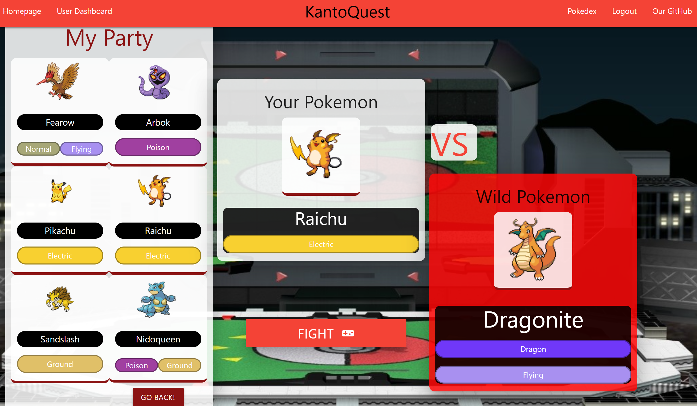
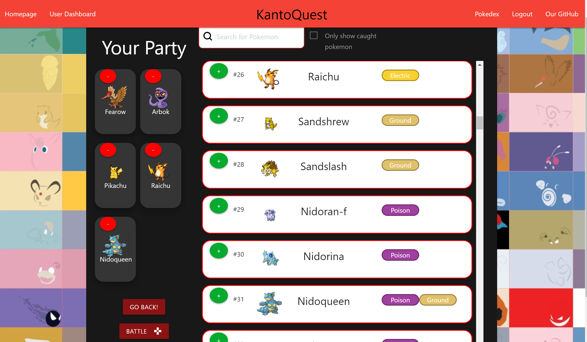

# KantoQuest: Pokemon Battle Simulator

## Description
Have you ever wanted to be the very best (like no one ever was)? With KantoQuest you can finally make that dream come true.

KantoQuest is a full stack application that allows you to simulate Pokemon Battles in real time. With this application you can choose your favorite Starter Pokemon and start your adventure by battling Wild Pokemon. 

Test your knowledge of Pokemon Types and their advantages to have a higher chance of success, the more Pokemon you defeat, the more Pokemon will become available for your party. 

Mix and match to find the best combination to continue with your winning streak and, perhaps, joing our Hall of Fame.

-------------------

## Dependencies

> pokedex-promise-v2

> bcrypt

> connect-session-sequelize

> dotenv

> express

> express-handlebars

> express-session

> mysql2

> node-fetch

> sequelize

## Usage/ Deployed Application: 

> Gotta catch 'em all!: https://stormy-wave-79983.herokuapp.com

------

## Application Documentation

### Choose your Starter Pokemon

### Trainer's Dashboard

### Select the right type to defeat your opponent

### Complete the 151 Pokedex Entries

## Our Gym Leaders

* [Mark Napolitano](https://github.com/MarkJNap)

* [Mauxi Moncada](https://github.com/MoMoncada)

* [Ryan McDiarmid](https://github.com/RyanMcd29)

------------

## License
[MIT License](https://opensource.org/license/mit/)